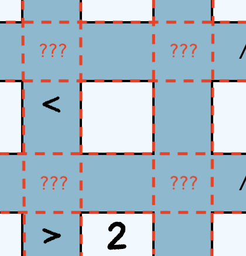

# Futoshiki

## What is this repo? 

This is a toy project which I created to
* share with a geeky friend a board of the [Futoshiki game](https://en.wikipedia.org/wiki/Futoshiki), 
which I found on a magazine;
* play around with the [Grid Layout](https://developer.mozilla.org/en-US/docs/Web/CSS/CSS_Grid_Layout), 
as it's something I had heard of, but never used hands on;
* try and apply some ideas from 
[an article on Martin Fowler's bliki](https://martinfowler.com/articles/modularizing-react-apps.html) that a coworker 
shared with me, so as to be able to have a better conversation with him.

## Structure

This project was bootstrapped with [Create React App](https://github.com/facebook/create-react-app) for a Typescript 
project, so all the common scripts apply (`npm start`, `npm test`, `npm run build`...)

## Learnings

Following are some considerations on things I noted or learnt implementing (admittedly in a rushed way) the 
visualization of the game board.

## Grid Layout

It's an interesting approach, and I find it a bit strange that there's a mixture of logical and physical information 
that you end up declaring in your CSS. I still have to digest it, and I have an extremely superficial grasp on it.

It turns out, I found, that it didn't have significant advantages to a standard `<table>` element in this specific 
case. As a matter of fact, in this scenario it seems to make the resulting HTML less readable, so I ended up reverting 
the choice and I went for a `<table>` instead.

## Data Modelling

This game poses an interesting challenge in terms of how the information can be represented.
At least I couldn't see any natural obvious representation. 

If the **values** can clearly be placed in tabular way, in a square matrix (an array of arrays), 
it is less obvious how to store the **constraints** between values. 

Creating a bigger matrix with the _n_ values and the _n - 1_ interleaved, creates a very sparse matrix, 
because a lot of the intersections wouldn't be significant.

Not wanting to spend too much time in designing how to store the data, I moved on to focus on
the interface that the board object would expose to the UI to display the grid.

### TDD'ing a suitable data structure ###
I did this with **TDD**.

After a (small) number of iterations I settled for an API that would tell me what were the constraints **either to left** 
of cell **or below** it. 

The internal representation of these constraints followed naturally, with two separate arrays.

I don't mean to state by any means that this is the best implementation. Is it the most memory saving? I don't think so.
The one that provides fastest access? I'd say good enough, but I'm not ruling out the possibility that there could be 
smarter implementations. But it's [simple](http://www.extremeprogramming.org/rules/simple.html) enough, and kind of 
makes sense.

## Persisting a board

So now I could visualize a board that was in memory. 

But what if I want to load its representation from a (remote) service?
Up to this point I built and displayed the board by using the APIs from the model, but the in memory
representation didn't -yet again- suggest anything obvious to me. 

*[JSONifying](https://developer.mozilla.org/en-US/docs/Web/JavaScript/Reference/Global_Objects/JSON/stringify)* was, 
of course an option. But I was hoping for a solution that
 * would not violate too much the encapsulation
 * could be human readable

Ideally I wanted to have a [DSL](https://en.wikipedia.org/wiki/Domain-specific_language) that would allow _describing_ 
the board in the most natural way. So I lookup some options (nah... who am I kidding? I picked the first that came up) 
and found [Ohm](https://ohmjs.org/). 

### TDD'ing a suitable language ###

Yet again I started imagining what would be the simplest statement that would allow me to configure a board. 

And then (you guess it), I started iterating on top of it, until I came up with the minimum language that would allow me to 
describe a board. 

An example is the one available [here](./src/model/SampleGame.ts).
